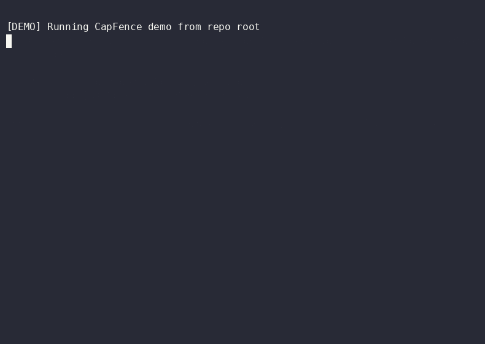

# CapFence

<p align="center">
  <strong>Deterministic trusted execution runtime for autonomous AI systems.</strong>
</p>

<p align="center">
  <a href="https://pypi.org/project/capfence/"></a>
  <a href="https://pypi.org/project/capfence/"></a>
  <a href="LICENSE"></a>
  
</p>

CapFence sits between autonomous AI agents and high-risk tools. It evaluates every operational action against deterministic policy before execution, then enforces it: allowing it, blocking it, or requiring immediate pre-authorized approval.

It operates closer to **IAM, CloudTrail, transaction gateways, and admission controllers** than prompt-injection guards or LLM moderation platforms.

```text
Agent -> CapFence Runtime -> High-Risk System
              |
              +-- [Allow] -> Execution
              +-- [Deny]  -> Fail-Closed Block
              +-- [Require Approval] -> Expiring / Session Pre-Authorizations
```

<p align="center">
  
</p>

CapFence is engineered for production environments where agents execute real operations (shell commands, database writes, financial transactions, API edits) and every action must be:
- **Attributable**: Known actor context.
- **Auditable**: Tamper-evident, hash-chained logs.
- **Replayable**: Incident simulation against historical traces.
- **Fail-Safe**: Complete isolation and default-deny policies.

---

## Why CapFence Exists

Autonomous AI systems call tools that modify cloud infrastructure, execute terminal commands, read sensitive database rows, and move money.

**Prompt instructions are not execution boundaries.** A prompt can be bypassed, ignored, or manipulated. 

CapFence adds a deterministic, out-of-band execution boundary that guarantees:
- **No LLM in the Gate Path**: Zero added non-determinism, zero high-latency model checks.
- **Fail-Closed Execution**: If policy verification, database check, or audit logging fails, the action is blocked.
- **Asymmetric Signature Chaining**: Local audit trails are cryptographically linked and signed using Ed25519 keys, preventing manual database tampering.
- **WAL Persistence Isolation**: Dynamic, thread-safe persistence using a pluggable DB Engine interface.

---

## Install

```bash
pip install capfence
```

---

## 60-Second Example

### 1. Write a Declarative Policy (`policies/ops.yaml`)

Define strict capabilities mapped to `resource.action.scope` with wildcard matching:

```yaml
deny:
  # Block destructive command patterns on the workspace resource
  - capability: filesystem.delete.workspace
    contains: "rm -rf"

require_approval:
  # Enforce pre-authorizations for high-value financial transfers
  - capability: payment.execute.high_value
    amount_gt: 1000

allow:
  # Standard low-risk reads are allowed
  - capability: filesystem.read.workspace

  # Payments under threshold require no manual approval
  - capability: payment.execute.high_value
    amount_lte: 1000
```

### 2. Enforce Safely at the SDK Boundary

```python
from capfence import ActionEvent, ActionRuntime, CapabilitySystem, ApprovalEngine, ImmutableAuditTrail

# 1. Initialize deterministic, low-latency primitives
caps = CapabilitySystem()
caps.load_policy("policies/ops.yaml")

runtime = ActionRuntime(
    capability_system=caps,
    approval_engine=ApprovalEngine(),
    audit_trail=ImmutableAuditTrail(),
)

# 2. Construct the governed action event
event = ActionEvent.create(
    actor="deployment-agent",
    action="delete",
    resource="filesystem.workspace",
    environment="production",
    risk="high",
    command="rm -rf /var/lib/postgresql"  # Triggers deny rule
)

# 3. Deterministic policy enforcement
verdict = runtime.execute(event)

if not verdict.authorized:
    raise PermissionError(f"Action blocked by CapFence: {verdict.reason}")

# Proceed to execute safe tool command...
```

---

## Core Production Features

### Ⅰ. Pluggable persistence ([BaseDBEngine](capfence/core/db.py))
CapFence isolates persistence operations using an abstract DB layer. Scale easily from a local, thread-safe, WAL-enabled SQLite engine to high-throughput, distributed **PostgreSQL** or **Redis** pools for multi-pod Kubernetes scaling.

### Ⅱ. Dynamic Pre-Authorizations ([ApprovalEngine](capfence/core/approvals.py))
Enforce human-in-the-loop validation without blocking agent execution. Support expiring temporary approvals (e.g. valid for 10 minutes) and session-locked capabilities directly in production.

### Ⅲ. Immutable Asymmetric Logs ([ImmutableAuditTrail](capfence/core/audit.py))
Log audit trails in an append-only, tamper-evident hash chain. When the `cryptography` library is available, every row is cryptographically signed using asymmetric Ed25519 keypairs, making manual database edits instantly detectable.

---

## CLI Workflows

### Scan for Ungated Agent Tools
Analyze your codebase in CI to ensure no tool classes are exposed without a CapFence gate interface:
```bash
capfence check ./src --fail-on-ungated
```

### Manually Grant Expiring Capability Pre-Authorizations
Ops administrators can manually provision expiring credentials to an active agent directly via the CLI:
```bash
# Grant 10-minute temporary push capability for production hotfix
capfence grant --actor hotfix-agent --capability github.push.main --duration 600
```

### Validate Local YAML Policies
```bash
capfence check-policy policies/ops.yaml
```

### Replay Event Traces for Incident Review or Compliance Audits
Reconstruct historical actions offline and run simulations to trace policy changes against saved execution trails:
```bash
capfence simulate --trace-file traces/agent_trace.jsonl --compare
```

### Verify Audit Database Chain Integrity
```bash
capfence verify --audit-log audit.db
```

---

## What CapFence Is Not

CapFence enforces execution policy boundaries for autonomous systems. It does not replace:
- **Process Sandboxing**: Always run agent code inside isolated runtimes (Docker, gVisor).
- **Least-Privilege Credentials**: Keep your IAM policies and database access credentials locked down.
- **Network Egress Isolation**: Keep agents isolated from unapproved public domains.
- **Prompt-Injection Guardrails**: Standard prompt filters remain active layers. CapFence is the final, deterministic fail-closed gateway.

---

## Project Status

CapFence is beta infrastructure for trusted autonomous execution.
- Docs: [docs/](docs/)
- PyPI: https://pypi.org/project/capfence/
- Repository: https://github.com/capfencelabs/capfence

---

## License

MIT License

<p align="center">
  <sub>Built with care by <a href="https://github.com/capfencelabs">CapFence Labs</a></sub>
</p>
